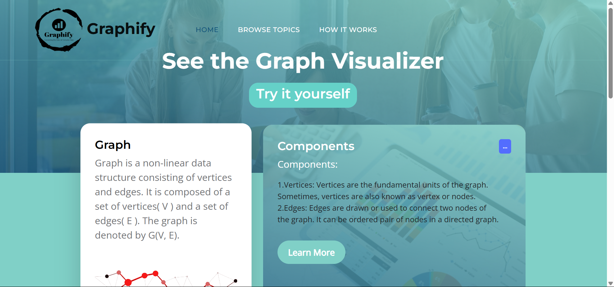
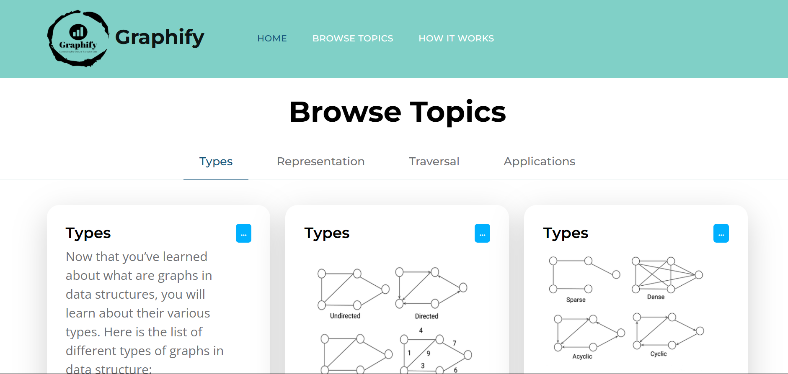
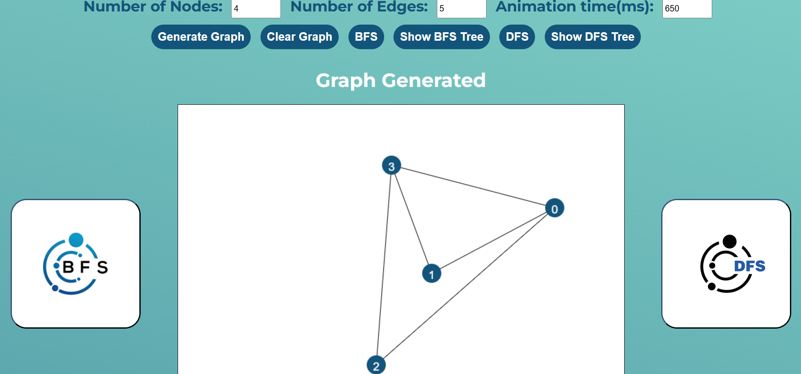
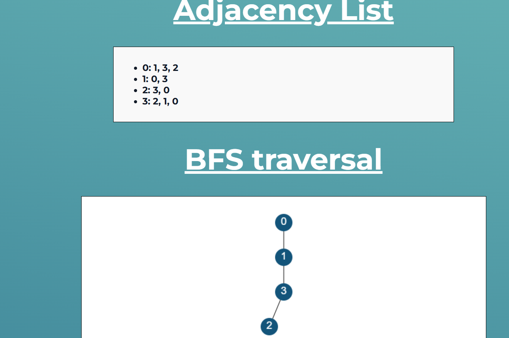
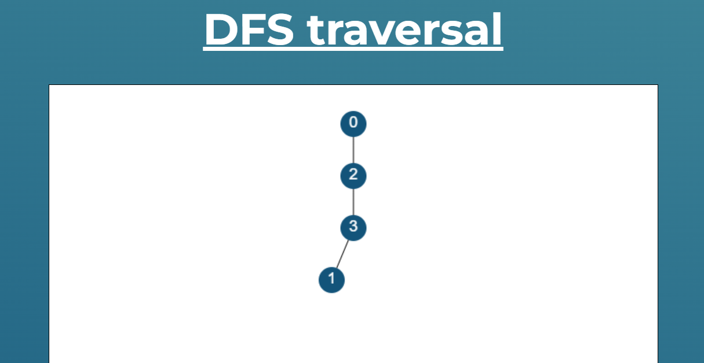

# Graph Traversal Visualizer

An interactive tool to visualize Breadth-First Search (BFS) and Depth-First Search (DFS) on randomly generated graphs. Built using HTML, CSS, and JavaScript.

## Features

- Random graph generation based on user input (nodes and edges)
- Visual tracing of BFS and DFS using color transitions
- Displays BFS/DFS traversal trees
- Adjacency list and matrix representation
- Simple and responsive UI

## Folder Structure

```text
Graph_Traversal_Visualizer/
├── css/
├── images/
├── js/
├── adjacency_matrix.html
├── Adjlist.html
├── Bfs.html
├── components.html
├── Dfs.html
├── index.html
├── types.html
├── visualising.html
└── README.md
```

## Technologies Used

- HTML5
- CSS3
- JavaScript

## Getting Started

1. Clone the repository:

git clone https://github.com/AnudeepikaKolluru/Graph_Traversal_Visualiser.git

2.Navigate to the project folder and open index.html in a web browser.

No extra setup or dependencies are needed.

## Screenshots

### Main Pages

| Page 1 | Page 2 |
|--------|--------|
|  |  |
### Graph Generated


### BFS Traversal


### DFS Tree



## Contributing

Contributions, issues, and feature requests are welcome!
Feel free to fork this repo and submit a pull request.
